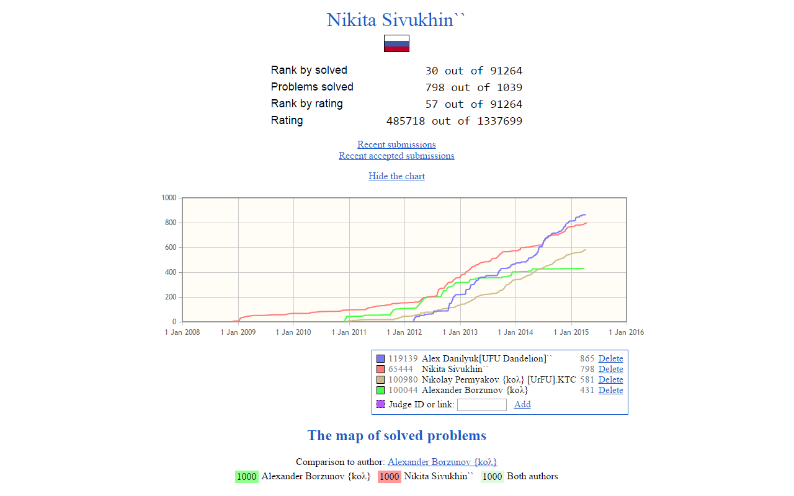

Timus Charts
============

Adds charts to Timus Online Judge profiles

Features
--------

* A chart of count of solved problems in profiles and during comparison
* Adding more users to the chart, removing them, customizing legend colors
* Caching profile data
* Hiding the chart
* _(optional)_ Highlighting problems accepted in recent two months

Built with [jqPlot](http://jqplot.com/).

Installation
------------

 **Google Chrome**

* The extension is available in [Chrome Web Store](https://chrome.google.com/webstore/detail/timus-charts/jholigcfjhipjahcjoccgkfjikkcekki).

 **Firefox**

1. Install [Greasemonkey](https://addons.mozilla.org/firefox/addon/greasemonkey/).

2. The extension will be available for installation on [the page on OpenUserJS.org](https://openuserjs.org/scripts/hx0/Timus_Charts).

 **Opera** > 12 and  **Yandex.Browser**

* The extension is available on [Opera Add-ons](https://addons.opera.com/extensions/details/timus-charts/).

 **Safari**

1. Install [Tampermonkey for Safari](https://tampermonkey.net/index.php?ext=dhdg&browser=safari).

2. The extension will be available for installation on [the page on OpenUserJS.org](https://openuserjs.org/scripts/hx0/Timus_Charts).

Authors
-------

Copyright (c) 2012-2013, 2015-2016 Alexander Borzunov

Highlighting of recent AC by [Slava Shklyaev](https://github.com/slava-sh).

See also
--------

* [Timus Friends](https://github.com/slava-sh/timus-friends) extension by [slava-sh](https://github.com/slava-sh)
